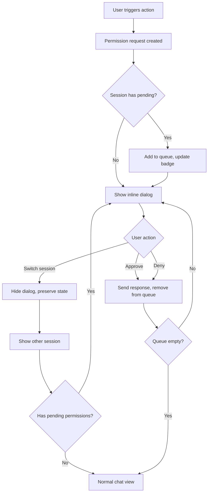

# feat: Per-Instance Permission Dialogs

## Overview

Transform the permission dialog from a blocking full-screen modal to a non-blocking, per-chat-instance inline UI that allows developers to switch between projects and sessions while permission requests remain pending.

**Problem Statement**: The current permission dialog takes the entire screen with `fixed inset-0` modal overlay, preventing users from switching between different projects/instances of Claude Code. Developers often want to postpone permission decisions and handle permissions across multiple sessions in any order.

**Solution**: Render permission dialogs inline within each chat instance, persist dialog state when switching sessions, and allow seamless navigation between instances without dismissing pending permissions.

## Technical Approach

### Current Architecture (Problem)

```
App.jsx
└── PermissionProvider (global)
    └── MainContent
        └── ChatInterface
            └── PermissionDialog (modal: fixed inset-0 z-50)
                ├── Blocks entire viewport
                ├── Cannot switch sessions
                └── State lost on session change
```

**Key Files**:
- `src/components/PermissionDialog.jsx:1-320` - Full-screen modal
- `src/components/ChatInterface.jsx:4809-4815` - Dialog rendering location
- `src/contexts/PermissionContext.jsx:1-295` - Global permission state
- `src/hooks/usePermissions.js:1-275` - Dialog open/close management

### Proposed Architecture (Solution)

```
App.jsx
└── PermissionProvider (global - manages all sessions)
    └── MainContent
        └── {sessions.map(session => (
              <PermissionInstanceProvider key={session.id} sessionId={session.id}>
                <ChatInterface>
                  <PermissionInlineDialog /> (positioned above input, z-40)
                  └── Non-blocking, scrollable chat
                </ChatInterface>
              </PermissionInstanceProvider>
            ))}
```

### Key Design Decisions

1. **Inline UI Position**: Fixed panel above chat input (not in message thread)
   - Rationale: Always visible when in session, doesn't clutter message history, clear affordance for action required

2. **State Management**: Session-scoped PermissionInstanceProvider wrapping each ChatInterface
   - Rationale: Isolates state per session, React keys prevent state bleed

3. **Persistence**: Enhanced sessionStorage with dialog visibility state
   - Rationale: Survives page refresh, already implemented for pending requests

4. **Non-Blocking**: Remove `inset-0` backdrop, use positioned panel
   - Rationale: Allows interaction with sidebar, session switching

## Implementation Phases

### Phase 1: Create PermissionInstanceProvider

Create a session-scoped context provider that manages permission state per chat instance.

**File**: `src/contexts/PermissionInstanceContext.jsx` (new)

```jsx
import { createContext, useContext, useState, useEffect, useCallback } from 'react';
import { usePermission } from './PermissionContext';

const PermissionInstanceContext = createContext(null);

export function PermissionInstanceProvider({ sessionId, children }) {
  const globalPermission = usePermission();
  const [instanceRequests, setInstanceRequests] = useState([]);
  const [dialogVisible, setDialogVisible] = useState(false);
  const [activeInstanceRequest, setActiveInstanceRequest] = useState(null);

  useEffect(() => {
    if (sessionId) {
      const requests = globalPermission.pendingRequests.filter(
        req => req.sessionId === sessionId
      );
      setInstanceRequests(requests);
      setDialogVisible(requests.length > 0);
      setActiveInstanceRequest(requests[0] || null);
    }
  }, [sessionId, globalPermission.pendingRequests]);

  const handleInstanceDecision = useCallback(async (requestId, decision) => {
    await globalPermission.handleDecision(requestId, decision);
  }, [globalPermission]);

  return (
    <PermissionInstanceContext.Provider value={{
      instanceRequests,
      activeInstanceRequest,
      dialogVisible,
      setDialogVisible,
      handleInstanceDecision,
      queueCount: instanceRequests.length,
      sessionId
    }}>
      {children}
    </PermissionInstanceContext.Provider>
  );
}

export const usePermissionInstance = () => useContext(PermissionInstanceContext);
```

**Tasks**:
- [ ] Create PermissionInstanceContext.jsx
- [ ] Export usePermissionInstance hook
- [ ] Add session filtering for pendingRequests
- [ ] Add dialog visibility state management

### Phase 2: Create PermissionInlineDialog Component

Replace blocking modal with positioned inline panel.

**File**: `src/components/PermissionInlineDialog.jsx` (new)

```jsx
import { usePermissionInstance } from '../contexts/PermissionInstanceContext';

export function PermissionInlineDialog() {
  const {
    activeInstanceRequest,
    dialogVisible,
    handleInstanceDecision,
    queueCount
  } = usePermissionInstance();

  if (!dialogVisible || !activeInstanceRequest) return null;

  return (
    <div className="sticky bottom-0 z-40 mx-4 mb-2">
      <div className="bg-white dark:bg-gray-800 rounded-lg shadow-2xl border border-amber-500/50 p-4">
        <div className="flex items-start gap-3">
          <div className="flex-shrink-0">
            {/* Risk indicator icon */}
          </div>
          <div className="flex-1 min-w-0">
            <div className="flex items-center gap-2 mb-1">
              <span className="font-medium text-sm">Permission Required</span>
              {queueCount > 1 && (
                <span className="text-xs bg-amber-100 text-amber-800 px-2 py-0.5 rounded-full">
                  +{queueCount - 1} more
                </span>
              )}
            </div>
            <p className="text-sm text-gray-600 dark:text-gray-400 truncate">
              {activeInstanceRequest.tool}: {activeInstanceRequest.description}
            </p>
            <div className="mt-3 flex gap-2">
              <button
                onClick={() => handleInstanceDecision(activeInstanceRequest.id, 'approve')}
                className="px-3 py-1.5 bg-green-600 text-white text-sm rounded hover:bg-green-700"
              >
                Allow (Y)
              </button>
              <button
                onClick={() => handleInstanceDecision(activeInstanceRequest.id, 'deny')}
                className="px-3 py-1.5 bg-red-600 text-white text-sm rounded hover:bg-red-700"
              >
                Deny (N)
              </button>
            </div>
          </div>
        </div>
      </div>
    </div>
  );
}
```

**Tasks**:
- [ ] Create PermissionInlineDialog.jsx
- [ ] Style as non-blocking panel (no backdrop)
- [ ] Add queue count indicator
- [ ] Port keyboard shortcuts (Y/N/A/S) from existing dialog
- [ ] Add risk level indicator
- [ ] Add expandable details section

### Phase 3: Integrate into ChatInterface

Wrap ChatInterface with PermissionInstanceProvider and render inline dialog.

**File**: `src/components/ChatInterface.jsx`

**Changes**:

```jsx
// Before: Modal dialog at end of component
{isDialogOpen && currentRequest && (
  <PermissionDialog ... />
)}

// After: Inline dialog within chat flow
<div className="flex flex-col h-full">
  <div className="flex-1 overflow-y-auto">
    {/* Message list */}
  </div>

  <PermissionInlineDialog />

  <div className="flex-shrink-0">
    {/* Input form */}
  </div>
</div>
```

**File**: `src/App.jsx` or parent component

```jsx
// Wrap each session with instance provider
{sessions.map(session => (
  <div
    key={session.id}
    className={activeSessionId === session.id ? 'block' : 'hidden'}
  >
    <PermissionInstanceProvider sessionId={session.id}>
      <ChatInterface sessionId={session.id} />
    </PermissionInstanceProvider>
  </div>
))}
```

**Tasks**:
- [ ] Remove modal PermissionDialog from ChatInterface
- [ ] Add PermissionInlineDialog above input area
- [ ] Wrap ChatInterface instances with PermissionInstanceProvider
- [ ] Use `hidden` instead of conditional rendering for session switching
- [ ] Preserve scroll position per session

### Phase 4: Update State Persistence

Enhance sessionStorage to include dialog visibility state.

**File**: `src/utils/permissionStorage.js`

```javascript
export function saveDialogState(sessionId, state) {
  const key = `claude-ui:permission-dialog:${sessionId}`;
  sessionStorage.setItem(key, JSON.stringify({
    visible: state.visible,
    activeRequestId: state.activeRequestId,
    timestamp: Date.now()
  }));
}

export function getDialogState(sessionId) {
  const key = `claude-ui:permission-dialog:${sessionId}`;
  const stored = sessionStorage.getItem(key);
  if (!stored) return null;

  const state = JSON.parse(stored);
  const TTL = 60 * 60 * 1000; // 1 hour
  if (Date.now() - state.timestamp > TTL) {
    sessionStorage.removeItem(key);
    return null;
  }
  return state;
}
```

**Tasks**:
- [ ] Add saveDialogState function
- [ ] Add getDialogState function
- [ ] Add TTL validation (1 hour)
- [ ] Integrate with PermissionInstanceProvider

### Phase 5: Add Session Indicators

Show which sessions have pending permissions.

**File**: `src/components/Sidebar.jsx` (or session list component)

```jsx
function SessionItem({ session, isActive, onClick }) {
  const { pendingRequests } = usePermission();
  const pendingCount = pendingRequests.filter(
    req => req.sessionId === session.id
  ).length;

  return (
    <button onClick={() => onClick(session)} className={...}>
      <span>{session.name}</span>
      {pendingCount > 0 && (
        <span className="ml-2 bg-amber-500 text-white text-xs px-1.5 py-0.5 rounded-full">
          {pendingCount}
        </span>
      )}
    </button>
  );
}
```

**Tasks**:
- [ ] Add pending permission count badge to session list items
- [ ] Add amber/warning color for sessions needing attention
- [ ] Update PermissionQueueIndicator to show cross-session total

## Acceptance Criteria

### Functional Requirements

- [ ] Permission dialog renders inline within chat (not full-screen modal)
- [ ] User can switch sessions while permission is pending
- [ ] Permission UI persists when returning to session
- [ ] Each session maintains independent permission state
- [ ] Keyboard shortcuts (Y/N/A/S/ESC) work when session is active
- [ ] Permission queue shows count for multiple pending requests
- [ ] Session list shows badge for sessions with pending permissions

### Non-Functional Requirements

- [ ] No visual jank when switching between sessions with pending permissions
- [ ] Page refresh restores pending permissions and dialog visibility
- [ ] Memory usage does not grow unbounded with many sessions
- [ ] Permission response latency unchanged from current implementation

### Quality Gates

- [ ] All existing permission tests pass
- [ ] New tests for session switching scenarios
- [ ] Manual testing: 5+ sessions with concurrent permissions
- [ ] Accessibility: Keyboard navigation works correctly

## Edge Cases & Error Handling

### Session Closure

When a session is closed/deleted with pending permissions:
1. Auto-deny all pending permissions for that session
2. Clean up sessionStorage entries
3. Send cancellation to backend via WebSocket
4. Remove session from PermissionQueueIndicator count

### Stale Permissions

Permission requests have 1-hour TTL:
1. Show timestamp "Requested X minutes ago" in inline UI
2. Auto-deny permissions older than 1 hour
3. Display warning indicator for permissions > 30 minutes old
4. Backend validates request age before processing response

### Network Failures

On approval/denial submission failure:
1. Show error state in inline UI
2. Retry up to 3 times with exponential backoff
3. Show "Retry" button after failures exhausted
4. Log error for debugging

### Page Refresh

On page refresh with pending permissions:
1. Restore pending requests from sessionStorage
2. Render inline dialogs lazily (only when session becomes active)
3. Validate TTL on restore, discard expired
4. Re-sync with backend via `permission-sync-request`

## Dependencies & Risks

### Dependencies

- PermissionContext changes require coordination with existing permission logic
- ChatInterface refactor may affect scroll behavior
- sessionStorage changes need backward compatibility

### Risks

| Risk | Impact | Mitigation |
|------|--------|------------|
| State desync between sessions | High | Add sync validation on session switch |
| Performance with many sessions | Medium | Use `hidden` class instead of unmounting |
| Keyboard shortcut conflicts | Medium | Only capture shortcuts when session active |
| sessionStorage corruption | Low | Add validation and fallback to server state |

## Files to Modify

### New Files
- `src/contexts/PermissionInstanceContext.jsx`
- `src/components/PermissionInlineDialog.jsx`

### Modified Files
- `src/components/ChatInterface.jsx:4809-4815` - Remove modal, add inline dialog
- `src/App.jsx:957-983` - Wrap sessions with PermissionInstanceProvider
- `src/utils/permissionStorage.js` - Add dialog state persistence
- `src/components/Sidebar.jsx` - Add pending permission badges
- `src/components/PermissionQueueIndicator.jsx` - Update for cross-session awareness
- `src/hooks/usePermissions.js` - Remove modal-specific logic

## References

### Internal References
- `src/components/PermissionDialog.jsx:1-320` - Current modal implementation
- `src/components/PermissionQueueIndicator.jsx:1-213` - Non-blocking pattern example
- `src/contexts/PermissionContext.jsx:1-295` - Permission state management
- `specs/permissions-and-approval-system.md` - Permission system spec
- `plans/permission-request-persistence-across-sessions.md` - Persistence implementation

### External References
- React Context for isolated state: https://react.dev/learn/passing-data-deeply-with-context
- State preservation with keys: https://react.dev/learn/preserving-and-resetting-state
- Non-blocking UI patterns: https://www.nngroup.com/articles/modal-nonmodal-dialog/

---



## MVP Implementation

### PermissionInlineDialog.jsx

```jsx
import { usePermissionInstance } from '../contexts/PermissionInstanceContext';

export function PermissionInlineDialog() {
  const {
    activeInstanceRequest,
    dialogVisible,
    handleInstanceDecision,
    queueCount
  } = usePermissionInstance();

  if (!dialogVisible || !activeInstanceRequest) return null;

  const { tool, description, risk = 'medium' } = activeInstanceRequest;

  const riskColors = {
    high: 'border-red-500 bg-red-50 dark:bg-red-900/20',
    medium: 'border-amber-500 bg-amber-50 dark:bg-amber-900/20',
    low: 'border-green-500 bg-green-50 dark:bg-green-900/20'
  };

  return (
    <div className={`mx-4 mb-2 rounded-lg border-2 p-4 ${riskColors[risk]}`}>
      <div className="flex items-center justify-between mb-2">
        <span className="font-semibold text-sm flex items-center gap-2">
          ⚠️ Permission Required
          {queueCount > 1 && (
            <span className="text-xs bg-gray-200 dark:bg-gray-700 px-2 py-0.5 rounded-full">
              +{queueCount - 1} queued
            </span>
          )}
        </span>
      </div>

      <p className="text-sm mb-1 font-medium">{tool}</p>
      <p className="text-xs text-gray-600 dark:text-gray-400 mb-3 break-all">
        {description}
      </p>

      <div className="flex gap-2">
        <button
          onClick={() => handleInstanceDecision(activeInstanceRequest.id, 'approve')}
          className="flex-1 px-3 py-2 bg-green-600 hover:bg-green-700 text-white text-sm font-medium rounded transition-colors"
        >
          Allow (Y)
        </button>
        <button
          onClick={() => handleInstanceDecision(activeInstanceRequest.id, 'deny')}
          className="flex-1 px-3 py-2 bg-red-600 hover:bg-red-700 text-white text-sm font-medium rounded transition-colors"
        >
          Deny (N)
        </button>
      </div>
    </div>
  );
}
```
