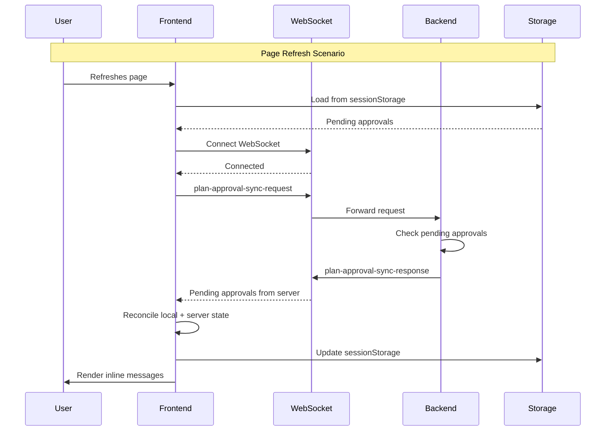

# Feature: Convert Plan Approval to Inline Message with Storage and Resume

**Status**: Planning
**Created**: 2025-12-01
**Type**: Enhancement
**Complexity**: High
**Estimated Effort**: 5-7 days

## Overview

Convert the plan approval system from a full-page modal dialog to an inline message component (similar to the permission system) with state persistence in storage and resume-after-refresh functionality via WebSocket synchronization.

**Current State**: Plan approvals show as blocking modal dialogs that disappear on page refresh
**Target State**: Plan approvals show as inline messages in chat with persistent state that survives refresh

## Problem Statement

The current plan approval UI has several limitations:

1. **Poor UX**: Full-page modal blocks the entire interface
2. **No Persistence**: Refreshing the page loses pending plan approvals
3. **No Multi-Session Support**: Cannot handle multiple sessions with independent plan approvals
4. **Inconsistent with Permissions**: Permission system uses inline messages, plan approvals use modals
5. **Lost Context**: Users lose conversation context when modal appears

## Motivation

- **User Experience**: Non-blocking inline UI allows users to see context while approving plans
- **Reliability**: State persistence ensures users don't lose pending approvals on refresh
- **Consistency**: Matches the proven pattern from the permission system
- **Multi-Session**: Supports users working with multiple chat sessions simultaneously
- **Visual Feedback**: Shows approval status after decision is made

## Proposed Solution

Adopt the 3-layer architecture pattern from the permission system:

```
┌─────────────────────────────────────────────────┐
│ PlanApprovalContext (Global)                    │
│ - Manages all plan approvals across sessions    │
│ - Handles WebSocket messages                    │
│ - Coordinates storage operations                │
└─────────────────┬───────────────────────────────┘
                  │
         ┌────────┴────────┐
         │                 │
┌────────▼────────┐ ┌─────▼──────────┐
│ PlanInstanceCtx │ │ PlanInstanceCtx│
│ (Session A)     │ │ (Session B)    │
│ - Filters for   │ │ - Filters for  │
│   Session A     │ │   Session B    │
└────────┬────────┘ └────────┬───────┘
         │                   │
    ┌────▼────┐         ┌────▼────┐
    │ Inline  │         │ Inline  │
    │ Message │         │ Message │
    └─────────┘         └─────────┘
```

## Technical Approach

### Architecture Layers

#### Layer 1: Global Context (`PlanApprovalContext.jsx`)

**Responsibilities**:
- Maintain global state for all plan approvals across all sessions
- Listen for WebSocket messages (`plan-approval-request`, `plan-approval-sync-response`)
- Coordinate with storage layer (sessionStorage + localStorage)
- Handle WebSocket sync on reconnection
- Manage decision submission to backend

**State**:
```javascript
{
  pendingApprovals: Map<sessionId, Array<PlanApproval>>,
  approvalDecisions: Map<planFingerprint, Decision>, // localStorage cache
  activeApproval: PlanApproval | null,
  isConnected: boolean
}
```

**Key Methods**:
- `enqueuePlanApproval(sessionId, planData)` - Add new approval to queue + save to storage
- `handleDecision(planId, decision)` - Process user decision + update storage
- `syncWithBackend()` - Request pending approvals on reconnect
- `dequeueNextApproval(sessionId)` - Move next pending to active

#### Layer 2: Instance Context (`PlanInstanceContext.jsx`)

**Responsibilities**:
- Filter global plan approvals to show only those for specific session
- Provide session-scoped hooks for components
- Manage inline dialog visibility for this session

**Props**:
- `sessionId: string` - Current session identifier

**Provided Values**:
```javascript
{
  activePlanForSession: PlanApproval | null,
  pendingCount: number,
  dialogVisible: boolean,
  handleInstanceDecision: (planId, decision) => void
}
```

#### Layer 3: Inline Component (`PlanInlineMessage.jsx`)

**Responsibilities**:
- Render inline approval UI in chat flow
- Display plan content (title, description, steps)
- Show decision buttons (Approve & Auto-Execute, Approve & Manual, Reject)
- Display approval badge after decision made
- Handle loading/error states

**Visual Design**:
```
┌─────────────────────────────────────────────────┐
│ 📋 Plan Approval Required                       │
│                                                 │
│ Title: Read File System                        │
│ Description: Access /Users/...                 │
│                                                 │
│ [Show Details ▼]                               │
│                                                 │
│ [✅ Approve & Execute] [✅ Approve] [❌ Reject] │
│                                                 │
│ +2 more pending approvals                      │
└─────────────────────────────────────────────────┘
```

**After Decision**:
```
┌─────────────────────────────────────────────────┐
│ ✅ Plan Approved - Read File System             │
│ Approved at 2:30 PM                            │
└─────────────────────────────────────────────────┘
```

### Storage Architecture

#### sessionStorage Strategy

**Purpose**: Persist pending approvals across page refresh (cleared on tab close)

**Storage Key Format**: `claude-ui:plan-approvals:{sessionId}`

**Schema**:
```javascript
{
  version: 1,
  sessionId: string,
  approvals: {
    [planId]: {
      planId: string,
      planData: {
        title: string,
        description: string,
        steps: Array<string>,
        metadata: object
      },
      status: 'pending' | 'approved' | 'rejected' | 'executed',
      requestedAt: number, // timestamp
      decidedAt: number | null,
      decision: null | 'approve_execute' | 'approve_manual' | 'reject',
      permissionMode: string | null, // for backend
      messageId: string | null // For rendering position
    }
  },
  lastUpdated: number
}
```

**TTL**: 24 hours (stale approvals cleaned on load)

**Utility Functions** (extend `src/utils/permissionStorage.js`):
```javascript
// Get pending plan approvals for session
getPlanApprovals(sessionId): PlanApproval[]

// Save plan approval
savePlanApproval(sessionId, approval): void

// Remove plan approval
removePlanApproval(sessionId, planId): void

// Update approval status
updatePlanApprovalStatus(sessionId, planId, status, decision): void

// Clean expired approvals
cleanExpiredPlanApprovals(): void
```

#### localStorage Strategy

**Purpose**: Cache permanent approval decisions (user preferences)

**Storage Key**: `claude-ui:permanent-plan-decisions`

**Schema**:
```javascript
{
  version: 1,
  decisions: {
    [planFingerprint]: {
      decision: 'always_approve' | 'always_reject',
      createdAt: number,
      expiresAt: number | null
    }
  }
}
```

**Plan Fingerprint**: Hash of `title + description + steps` to detect similar plans

**Note**: Initial version may skip permanent decisions feature to reduce complexity

### WebSocket Integration

#### Message Types

**Frontend → Backend**:
```javascript
// Request sync on reconnect
{
  type: 'plan-approval-sync-request',
  sessionIds: Array<string>, // Sessions user has open
  timestamp: number
}

// Send user decision
{
  type: 'plan-approval-decision',
  sessionId: string,
  planId: string,
  decision: 'approve_execute' | 'approve_manual' | 'reject',
  permissionMode: string,
  timestamp: number
}
```

**Backend → Frontend**:
```javascript
// Sync response with pending approvals
{
  type: 'plan-approval-sync-response',
  approvals: Array<{
    sessionId: string,
    planId: string,
    planData: {
      title: string,
      description: string,
      steps: Array<string>,
      metadata: object
    },
    requestedAt: number
  }>
}

// New plan approval request
{
  type: 'plan-approval-request',
  sessionId: string,
  planId: string,
  planData: object,
  requestedAt: number
}

// Decision acknowledgment
{
  type: 'plan-approval-decision-ack',
  sessionId: string,
  planId: string,
  success: boolean,
  error: string | null // 'expired' | 'invalid_session' | 'already_decided'
}
```

#### Sync Flow



### Integration Points

#### 1. Wrap ChatInterface with Instance Provider

**File**: `src/components/MainContent.jsx`
**Location**: Around line 474 (where PermissionInstanceProvider is)

```javascript
<PlanInstanceProvider sessionId={selectedSession?.id}>
  <PermissionInstanceProvider sessionId={selectedSession?.id}>
    <ChatInterface
      sessionId={selectedSession?.id}
      messages={messages}
      // ...
    />
  </PermissionInstanceProvider>
</PlanInstanceProvider>
```

#### 2. Render Inline Message in Chat

**File**: `src/components/ChatInterface.jsx`
**Location**: Around line 4450 (after PermissionInlineDialog)

```javascript
{/* Permission inline dialog */}
<PermissionInlineDialog />

{/* Plan approval inline message */}
<PlanInlineMessage />
```

**Positioning Strategy**: Render at bottom of message list, before input form

#### 3. Update PlanApprovalContext

**File**: `src/contexts/PlanApprovalContext.jsx` (modify existing)

**Changes**:
- Convert from single `activePlan` to `pendingApprovals` Map
- Add storage integration
- Add WebSocket sync handler
- Add multi-session support

#### 4. Backend Integration

**File**: `server/services/planApprovalManager.js` (modify existing)

**Changes Needed**:
- Add state persistence (in-memory Map or database)
- Add sync endpoint to query pending approvals by session
- Handle `plan-approval-sync-request` message
- Track plan approvals by session ID
- Add cleanup for expired approvals

## Implementation Phases

### Phase 1: Storage Layer (1 day)

**Files to Create/Modify**:
- `src/utils/planApprovalStorage.js` (new) - Storage utility functions
- `src/utils/permissionStorage.js` (extend) - Shared storage patterns

**Tasks**:
- [ ] Define storage schemas (sessionStorage + localStorage)
- [ ] Implement `getPlanApprovals(sessionId)`
- [ ] Implement `savePlanApproval(sessionId, approval)`
- [ ] Implement `removePlanApproval(sessionId, planId)`
- [ ] Implement `updatePlanApprovalStatus(sessionId, planId, status, decision)`
- [ ] Implement `cleanExpiredPlanApprovals()` with 24-hour TTL
- [ ] Add error handling for storage quota exceeded
- [ ] Add JSON serialization/deserialization with validation
- [ ] Write unit tests for storage layer

**Acceptance Criteria**:
- ✅ Storage functions handle missing data gracefully
- ✅ TTL validation filters expired approvals
- ✅ Storage quota errors handled without crashes
- ✅ Unit tests cover all storage functions

### Phase 2: Backend Sync Support (1-2 days)

**Files to Modify**:
- `server/services/planApprovalManager.js` (existing)
- `server/routes/websocket.js` (if exists) or equivalent

**Tasks**:
- [ ] Add in-memory Map to track pending approvals by session
- [ ] Implement `getPendingApprovals(sessionIds)` method
- [ ] Add WebSocket handler for `plan-approval-sync-request`
- [ ] Send `plan-approval-sync-response` with pending approvals
- [ ] Modify existing approval flow to track session ID
- [ ] Add cleanup logic for expired approvals (24 hour TTL)
- [ ] Add acknowledgment message (`plan-approval-decision-ack`)
- [ ] Handle duplicate approval requests (deduplication by planId)
- [ ] Add logging for debugging sync issues
- [ ] Test with multiple sessions

**Acceptance Criteria**:
- ✅ Backend persists pending approvals in memory
- ✅ Sync request returns all pending approvals for user's sessions
- ✅ Duplicate requests handled gracefully
- ✅ Expired approvals cleaned up automatically
- ✅ Decision acknowledgment sent to frontend

### Phase 3: Global Context Implementation (1-2 days)

**Files to Create/Modify**:
- `src/contexts/PlanApprovalContext.jsx` (modify existing)
- `src/hooks/usePlanApproval.js` (new)

**Tasks**:
- [ ] Refactor from single `activePlan` to `pendingApprovals` Map
- [ ] Add storage integration (load on mount, save on change)
- [ ] Implement `enqueuePlanApproval(sessionId, planData)`
- [ ] Implement `handleDecision(planId, decision)`
- [ ] Implement `syncWithBackend()` for WebSocket reconnect
- [ ] Add WebSocket message handlers:
  - [ ] `plan-approval-request` - New approval request
  - [ ] `plan-approval-sync-response` - Restore pending on reconnect
  - [ ] `plan-approval-decision-ack` - Confirmation from backend
- [ ] Add state reconciliation (merge local + server state)
- [ ] Implement `dequeueNextApproval(sessionId)` for queue management
- [ ] Add connection state tracking (`isConnected`)
- [ ] Create custom hook `usePlanApproval()` to expose context
- [ ] Handle error scenarios (network timeout, backend rejection)
- [ ] Add cleanup on unmount

**Acceptance Criteria**:
- ✅ Context maintains global state for all sessions
- ✅ Storage operations triggered automatically
- ✅ WebSocket messages handled correctly
- ✅ Sync on reconnect restores pending approvals
- ✅ State reconciliation prevents duplicates
- ✅ Custom hook provides clean API for consumers

### Phase 4: Instance Context Implementation (1 day)

**Files to Create**:
- `src/contexts/PlanInstanceContext.jsx` (new)
- `src/hooks/usePlanInstance.js` (new)

**Tasks**:
- [ ] Create `PlanInstanceContext` provider component
- [ ] Filter global `pendingApprovals` by `sessionId` prop
- [ ] Provide `activePlanForSession` (first pending for this session)
- [ ] Provide `pendingCount` (total pending for this session)
- [ ] Provide `dialogVisible` boolean state
- [ ] Provide `handleInstanceDecision(planId, decision)` wrapper
- [ ] Update global context when decision made
- [ ] Create custom hook `usePlanInstance()`
- [ ] Add error boundary for isolated failures
- [ ] Write tests for session filtering logic

**Acceptance Criteria**:
- ✅ Context filters correctly by session ID
- ✅ Multiple instances can coexist (multi-session support)
- ✅ Decision in one instance doesn't affect others
- ✅ Pending count updates correctly
- ✅ Custom hook provides type-safe API

### Phase 5: Inline Message Component (1-2 days)

**Files to Create**:
- `src/components/PlanInlineMessage.jsx` (new)

**Tasks**:
- [ ] Create inline message component structure
- [ ] Consume `usePlanInstance()` hook
- [ ] Render plan approval UI:
  - [ ] Plan title and description
  - [ ] Expandable details section (show steps)
  - [ ] Three decision buttons:
    - [ ] "Approve & Auto-Execute" (approve with auto permission mode)
    - [ ] "Approve & Manual" (approve with manual permission mode)
    - [ ] "Reject"
  - [ ] Pending count badge ("+X more pending")
  - [ ] Timestamp display
- [ ] Add loading state (while decision is being processed)
- [ ] Add error state (if decision fails)
- [ ] Implement badge display after decision:
  - [ ] Green badge with checkmark for "Approved"
  - [ ] Red badge with X for "Rejected"
  - [ ] Show approval timestamp
  - [ ] Dismissible or auto-hide after 10 seconds
- [ ] Add animations (slide in/out, expand/collapse details)
- [ ] Style with Tailwind CSS (match existing theme)
- [ ] Add keyboard navigation (Tab, Enter, Escape)
- [ ] Add ARIA labels for accessibility
- [ ] Handle edge case: approval while component unmounting
- [ ] Write component tests (React Testing Library)

**Acceptance Criteria**:
- ✅ Component renders inline without blocking chat
- ✅ Plan content displayed clearly
- ✅ All decision buttons functional
- ✅ Badge shows after decision made
- ✅ Loading and error states work
- ✅ Animations smooth and non-jarring
- ✅ Keyboard navigation works
- ✅ Accessible (screen reader compatible)

### Phase 6: Integration & Testing (1-2 days)

**Files to Modify**:
- `src/components/MainContent.jsx` (add PlanInstanceProvider)
- `src/components/ChatInterface.jsx` (render PlanInlineMessage)

**Tasks**:
- [ ] Wrap ChatInterface with `PlanInstanceProvider` in MainContent
- [ ] Pass `sessionId` prop to PlanInstanceProvider
- [ ] Render `<PlanInlineMessage />` in ChatInterface (after PermissionInlineDialog)
- [ ] Test single session flow:
  - [ ] Request approval → shows inline message
  - [ ] Approve → sends to backend → shows badge
  - [ ] Refresh page → message restores
- [ ] Test multi-session flow:
  - [ ] Open 2 sessions
  - [ ] Request approval in Session A → shows only in A
  - [ ] Request approval in Session B → shows only in B
  - [ ] Approve in A → only A updates
- [ ] Test WebSocket sync:
  - [ ] Disconnect WebSocket → reconnect → pending approvals restore
  - [ ] Refresh while offline → reconnect → sync works
- [ ] Test storage:
  - [ ] sessionStorage saves on request
  - [ ] sessionStorage loads on refresh
  - [ ] sessionStorage cleaned after 24 hours
- [ ] Test error scenarios:
  - [ ] Network timeout → shows error
  - [ ] Backend rejection → shows error message
  - [ ] Storage quota exceeded → graceful degradation
- [ ] Test queue management:
  - [ ] Multiple pending approvals → shown in order
  - [ ] Approve first → second becomes active
  - [ ] Pending count updates correctly
- [ ] Test edge cases:
  - [ ] Duplicate requests → deduped
  - [ ] Expired approvals → filtered out
  - [ ] Backend restart → sync recovers state
- [ ] Performance testing:
  - [ ] 10+ pending approvals → UI remains responsive
  - [ ] Storage operations don't block rendering
- [ ] Accessibility testing:
  - [ ] Screen reader announces approvals
  - [ ] Keyboard navigation works
  - [ ] Focus management correct

**Acceptance Criteria**:
- ✅ All user flows work end-to-end
- ✅ Multi-session support works correctly
- ✅ Storage persistence works after refresh
- ✅ WebSocket sync works after reconnect
- ✅ Error handling doesn't crash UI
- ✅ Performance acceptable with many pending approvals
- ✅ Accessible to keyboard and screen reader users

## Success Metrics

**User Experience**:
- Plan approvals no longer block the entire UI
- Users can see conversation context while approving
- Pending approvals survive page refresh 100% of the time
- Multi-session workflows supported without confusion

**Technical**:
- No data loss on refresh (target: 100% restore rate)
- Sync completes within 2 seconds of reconnect (95th percentile)
- Storage operations don't block UI rendering (< 16ms)
- Component re-renders minimized (use React.memo where appropriate)

**Quality**:
- Test coverage > 80% for new code
- Zero accessibility violations (axe-core)
- Zero console errors or warnings in production

## Dependencies & Prerequisites

**Internal Dependencies**:
- Existing permission system (pattern to follow)
- WebSocket infrastructure (already in place)
- sessionStorage utilities (can reuse/extend)
- Chat message rendering (integration point)

**External Dependencies**:
- React 18.2.0 (already in project)
- lucide-react (icons, already in project)
- Tailwind CSS (styling, already in project)

**Prerequisites**:
- Session ID must be available in ChatInterface props
- WebSocket connection must support new message types
- Backend must be able to track pending approvals by session

## Risk Analysis & Mitigation

| Risk | Likelihood | Impact | Mitigation |
|------|-----------|--------|------------|
| Storage quota exceeded | Low | Medium | Implement TTL cleanup, compress data, show user warning |
| WebSocket sync fails | Medium | High | Fallback to localStorage, retry with exponential backoff |
| Backend state lost on restart | Medium | High | Document limitation, consider database persistence (future) |
| Race condition (duplicate decisions) | Low | Medium | Add request deduplication by planId, backend idempotency |
| Multi-session state conflicts | Low | Medium | Careful session ID scoping, thorough testing |
| Performance with many pending | Low | Medium | Virtual scrolling if needed, batch updates |
| Browser compatibility issues | Low | Low | Test on Chrome, Firefox, Safari, Edge |

## Alternative Approaches Considered

### Option 1: Keep Modal, Add Storage Only ❌

**Pros**: Simpler implementation, less UI work
**Cons**: Doesn't solve UX issues, still blocks UI
**Rejected**: User experience is primary goal

### Option 2: Sidebar Panel for Approvals ❌

**Pros**: Doesn't clutter chat, can show all pending
**Cons**: Less contextual, requires more screen space
**Rejected**: Inline is more contextual and consistent with permissions

### Option 3: Toast Notifications ❌

**Pros**: Very unobtrusive
**Cons**: Disappear quickly, hard to review plan details
**Rejected**: Not suitable for important decisions requiring review

### Option 4: Inline Message (Selected) ✅

**Pros**: Contextual, non-blocking, consistent with permissions, proven pattern
**Cons**: More complex multi-session handling
**Selected**: Best balance of UX and technical feasibility

## Future Considerations

**Phase 2 Enhancements** (not in initial scope):

1. **Permanent Approval Decisions**
   - "Always approve plans like this" checkbox
   - Store plan fingerprints in localStorage
   - Auto-approve similar plans

2. **Plan Diff/Change Detection**
   - Highlight what changed if plan requested again
   - Show diff from previous approval

3. **Approval History**
   - View all past approvals in session
   - Search and filter approval history

4. **Plan Editing**
   - Allow users to modify plan steps before approving
   - Send modified plan back to backend

5. **Approval Templates**
   - Save common approval patterns
   - Quick-approve with templates

6. **Database Persistence**
   - Store pending approvals in backend database
   - Survive backend restarts

7. **Analytics**
   - Track approval/rejection rates
   - Identify frequently rejected plans
   - Optimize plan presentation

## Documentation Plan

**Files to Create/Update**:

1. **Component Documentation**:
   - `docs/components/PlanInlineMessage.md` - Component API and usage
   - `docs/components/PlanApprovalContext.md` - Context API and hooks

2. **Architecture Documentation**:
   - `docs/architecture/plan-approval-flow.md` - System architecture and data flow
   - Include Mermaid diagrams for visual clarity

3. **Storage Documentation**:
   - `docs/storage/plan-approval-storage.md` - Storage schema and operations
   - Document TTL policies and cleanup

4. **Testing Documentation**:
   - `docs/testing/plan-approval-testing.md` - Test scenarios and checklist
   - Include manual testing procedures

5. **User Guide**:
   - `docs/user-guide/plan-approvals.md` - End-user documentation
   - Screenshots and GIFs of UI

6. **API Documentation**:
   - `docs/api/plan-approval-websocket.md` - WebSocket message reference
   - Include request/response examples

## References & Research

### Internal References

**Existing Implementation to Follow**:
- `/Users/dima/Documents/3OpenSource/claude-code-ui-2/src/contexts/PermissionContext.jsx:1-282` - Context pattern
- `/Users/dima/Documents/3OpenSource/claude-code-ui-2/src/contexts/PermissionInstanceContext.jsx:1-117` - Instance filtering
- `/Users/dima/Documents/3OpenSource/claude-code-ui-2/src/components/PermissionInlineDialog.jsx:1-212` - Inline UI component
- `/Users/dima/Documents/3OpenSource/claude-code-ui-2/src/utils/permissionStorage.js:1-104` - Storage utilities
- `/Users/dima/Documents/3OpenSource/claude-code-ui-2/src/hooks/usePermissions.js:1-282` - WebSocket integration

**Current Plan Approval Implementation**:
- `/Users/dima/Documents/3OpenSource/claude-code-ui-2/server/services/planApprovalManager.js:1-139` - Backend manager
- `/Users/dima/Documents/3OpenSource/claude-code-ui-2/src/contexts/PlanApprovalContext.jsx:1-112` - Frontend context
- `/Users/dima/Documents/3OpenSource/claude-code-ui-2/src/components/PlanApprovalDialog.jsx` - Current modal (to replace)

**Integration Points**:
- `/Users/dima/Documents/3OpenSource/claude-code-ui-2/src/components/ChatInterface.jsx:4450` - Render location
- `/Users/dima/Documents/3OpenSource/claude-code-ui-2/src/components/MainContent.jsx:474` - Provider wrapping

**Documentation & Specs**:
- `/Users/dima/Documents/3OpenSource/claude-code-ui-2/specs/plan-approval-implementation.md:1-263` - Original design doc
- `/Users/dima/Documents/3OpenSource/claude-code-ui-2/specs/plan-approval-fixes.md:1-292` - User requirements for inline conversion
- `/Users/dima/Documents/3OpenSource/claude-code-ui-2/docs/solutions/integration-issues/permission-dialog-lost-after-refresh-20251201.md:1-282` - Refresh troubleshooting case study
- `/Users/dima/Documents/3OpenSource/claude-code-ui-2/PERMISSION_SYSTEM_TEST.md:1-386` - Testing guide for reference

### External References

**Official Documentation**:
- [React useState Hook](https://react.dev/reference/react/useState)
- [React useEffect Hook](https://react.dev/reference/react/useEffect)
- [React Context API](https://react.dev/reference/react/useContext)
- [sessionStorage API](https://developer.mozilla.org/en-US/docs/Web/API/Window/sessionStorage)
- [localStorage API](https://developer.mozilla.org/en-US/docs/Web/API/Window/localStorage)
- [WebSocket API](https://developer.mozilla.org/en-US/docs/Web/API/WebSocket)

**Best Practices**:
- [Web.dev Storage Guide](https://web.dev/articles/storage-for-the-web)
- [LogRocket - Using localStorage with React Hooks](https://blog.logrocket.com/using-localstorage-react-hooks)
- [Kent C. Dodds - Application State Management](https://kentcdodds.com/blog/application-state-management-with-react)
- [Refactoring Guru - Memento Pattern](https://refactoring.guru/design-patterns/memento)

**Libraries (Already in Project)**:
- [React](https://react.dev) v18.2.0
- [lucide-react](https://lucide.dev) v0.515.0 - Icons
- [Tailwind CSS](https://tailwindcss.com) - Styling
- [ws](https://github.com/websockets/ws) v8.14.2 - WebSocket library

## Open Questions & Decisions Needed

### CRITICAL - Need Answers Before Implementation

1. **Session ID Definition** ⚠️
   - **Question**: Is session ID = conversation ID, or is it tab-specific?
   - **Impact**: Affects multi-tab behavior and storage isolation
   - **Recommendation**: Use conversation ID (allows tab sharing)

2. **Backend State Persistence** ⚠️
   - **Question**: Does backend persist pending approvals across restarts?
   - **Impact**: Sync reliability
   - **Options**: In-memory only, Database, Redis cache
   - **Recommendation**: Start with in-memory, add DB persistence in Phase 2

3. **Repeat Approval Behavior** ⚠️
   - **Question**: If same plan requested again, auto-approve or ask again?
   - **Impact**: User experience and deduplication logic
   - **Recommendation**: Always ask (plans may have changed context)

4. **WebSocket Message Format** ⚠️
   - **Question**: Exact field names and types for sync messages?
   - **Impact**: Frontend-backend contract
   - **Action**: Review backend code to align with existing patterns

5. **Badge Lifecycle** ⚠️
   - **Question**: Badge dismissible? Auto-hide? Persist on refresh?
   - **Impact**: User feedback and UI design
   - **Recommendation**: Show for 10 seconds then fade, don't persist on refresh

### IMPORTANT - Can Proceed with Assumptions

6. **Multiple Pending UI**
   - **Assumption**: Stack vertically, show pending count badge
   - **Can adjust**: Based on user feedback

7. **Error Handling**
   - **Assumption**: Show inline error + retry button
   - **Can adjust**: Based on error frequency

8. **Storage TTL**
   - **Assumption**: 24 hours for pending approvals
   - **Can adjust**: Based on user patterns

9. **Inline Message Position**
   - **Assumption**: Bottom of chat, before input
   - **Can adjust**: Could add message ID for contextual positioning later

10. **Plan Fingerprinting**
    - **Assumption**: Not needed in Phase 1 (no permanent decisions)
    - **Can add**: In Phase 2 when implementing "always approve"

## Acceptance Criteria Summary

### Functional Requirements

- [ ] Plan approval requests appear as inline messages in chat
- [ ] Inline messages non-blocking (can scroll and read chat)
- [ ] Three decision buttons: Approve & Auto-Execute, Approve & Manual, Reject
- [ ] Badge shows after decision made (green checkmark or red X)
- [ ] Multiple pending approvals queue correctly
- [ ] Pending count badge shows "+X more pending"
- [ ] Expandable details section for plan steps

### State Persistence Requirements

- [ ] Pending approvals saved to sessionStorage automatically
- [ ] Page refresh restores pending approvals from storage
- [ ] Storage expires after 24 hours (stale data cleaned)
- [ ] Storage operations don't block UI
- [ ] Storage quota exceeded handled gracefully

### WebSocket Sync Requirements

- [ ] On WebSocket reconnect, request pending approvals from backend
- [ ] Backend responds with all pending approvals for user's sessions
- [ ] Frontend reconciles local storage + server state
- [ ] Duplicate approvals detected and ignored
- [ ] Decision sent to backend receives acknowledgment

### Multi-Session Requirements

- [ ] Each ChatInterface wrapped in PlanInstanceProvider with sessionId
- [ ] Inline messages filtered to show only approvals for that session
- [ ] Decision in one session doesn't affect other sessions
- [ ] Pending count accurate per session
- [ ] Multiple sessions can have pending approvals simultaneously

### Error Handling Requirements

- [ ] Network timeout shows error message + retry option
- [ ] Backend rejection shows specific error (expired, invalid session, etc.)
- [ ] WebSocket disconnect/reconnect handled gracefully
- [ ] Storage errors don't crash application
- [ ] All errors logged for debugging

### Performance Requirements

- [ ] Initial render < 100ms
- [ ] Storage operations < 16ms (don't block frame)
- [ ] WebSocket sync completes < 2 seconds (95th percentile)
- [ ] UI remains responsive with 10+ pending approvals
- [ ] Component re-renders minimized (use React.memo)

### Accessibility Requirements

- [ ] ARIA labels on all interactive elements
- [ ] Keyboard navigation works (Tab, Enter, Escape)
- [ ] Screen reader announces new approvals
- [ ] Focus management correct
- [ ] Color contrast meets WCAG AA (4.5:1)
- [ ] No accessibility violations (axe-core)

### Quality Gates

- [ ] Test coverage > 80% for new code
- [ ] All integration tests pass
- [ ] E2E tests cover critical user flows
- [ ] No console errors or warnings
- [ ] Code review approved by 2+ reviewers
- [ ] Documentation complete and reviewed

## Rollback Plan

If critical issues found after deployment:

1. **Immediate**: Feature flag to toggle between inline and modal
2. **Short-term**: Revert to modal if data loss detected
3. **Long-term**: Fix issues and re-deploy

**Feature Flag Implementation**:
```javascript
// src/config/features.js
export const FEATURES = {
  PLAN_APPROVAL_INLINE: process.env.REACT_APP_PLAN_INLINE === 'true'
};

// In ChatInterface.jsx
{FEATURES.PLAN_APPROVAL_INLINE ? (
  <PlanInlineMessage />
) : (
  <PlanApprovalDialog />
)}
```

## Timeline Estimate

**Total Estimated Effort**: 5-7 working days

| Phase | Duration | Dependencies |
|-------|----------|--------------|
| Phase 1: Storage Layer | 1 day | None |
| Phase 2: Backend Sync | 1-2 days | Phase 1 complete |
| Phase 3: Global Context | 1-2 days | Phase 1 & 2 complete |
| Phase 4: Instance Context | 1 day | Phase 3 complete |
| Phase 5: Inline Component | 1-2 days | Phase 4 complete |
| Phase 6: Integration & Testing | 1-2 days | Phase 5 complete |

**Parallelization Opportunities**:
- Phase 1 & 2 can partially overlap (backend work independent)
- Component styling (Phase 5) can start once designs approved

**Critical Path**: Phase 1 → Phase 3 → Phase 4 → Phase 5 → Phase 6

---

## Appendix A: File Structure

```
claude-code-ui-2/
├── src/
│   ├── components/
│   │   ├── PlanInlineMessage.jsx (NEW)
│   │   ├── PlanApprovalDialog.jsx (DEPRECATE)
│   │   └── ChatInterface.jsx (MODIFY)
│   ├── contexts/
│   │   ├── PlanApprovalContext.jsx (MODIFY)
│   │   └── PlanInstanceContext.jsx (NEW)
│   ├── hooks/
│   │   ├── usePlanApproval.js (NEW)
│   │   └── usePlanInstance.js (NEW)
│   ├── utils/
│   │   └── planApprovalStorage.js (NEW)
├── server/
│   └── services/
│       └── planApprovalManager.js (MODIFY)
├── docs/
│   ├── components/
│   │   ├── PlanInlineMessage.md (NEW)
│   │   └── PlanApprovalContext.md (NEW)
│   ├── architecture/
│   │   └── plan-approval-flow.md (NEW)
│   └── testing/
│       └── plan-approval-testing.md (NEW)
└── tests/
    ├── unit/
    │   ├── planApprovalStorage.test.js (NEW)
    │   └── PlanApprovalContext.test.jsx (NEW)
    ├── integration/
    │   └── planApprovalFlow.test.jsx (NEW)
    └── e2e/
        └── planApprovalEndToEnd.spec.js (NEW)
```

## Appendix B: Storage Schema Examples

### sessionStorage Example

**Key**: `claude-ui:plan-approvals:conv-abc-123`

```json
{
  "version": 1,
  "sessionId": "conv-abc-123",
  "approvals": {
    "plan-xyz-789": {
      "planId": "plan-xyz-789",
      "planData": {
        "title": "Read File System",
        "description": "Access /Users/dima/Documents to read configuration files",
        "steps": [
          "Read .env file",
          "Parse configuration",
          "Validate settings"
        ],
        "metadata": {
          "estimatedTime": "2 seconds",
          "risk": "low"
        }
      },
      "status": "pending",
      "requestedAt": 1701446400000,
      "decidedAt": null,
      "decision": null,
      "permissionMode": null,
      "messageId": "msg-456"
    }
  },
  "lastUpdated": 1701446400000
}
```

### localStorage Example (Phase 2)

**Key**: `claude-ui:permanent-plan-decisions`

```json
{
  "version": 1,
  "decisions": {
    "hash-abc123": {
      "planFingerprint": "hash-abc123",
      "planTitle": "Read configuration files",
      "decision": "always_approve",
      "permissionMode": "auto",
      "createdAt": 1701446400000,
      "expiresAt": null
    }
  }
}
```

## Appendix C: Component Props & Hooks API

### PlanInlineMessage Component

```typescript
// No props - uses usePlanInstance() hook

interface UsePlanInstanceReturn {
  activePlanForSession: PlanApproval | null;
  pendingCount: number;
  dialogVisible: boolean;
  handleInstanceDecision: (planId: string, decision: Decision) => Promise<void>;
}

type Decision = 'approve_execute' | 'approve_manual' | 'reject';

interface PlanApproval {
  planId: string;
  planData: {
    title: string;
    description: string;
    steps: string[];
    metadata: object;
  };
  status: 'pending' | 'approved' | 'rejected' | 'executed';
  requestedAt: number;
  decidedAt: number | null;
  decision: Decision | null;
  sessionId: string;
}
```

### PlanApprovalContext Hooks

```typescript
// Global context hook
function usePlanApproval(): {
  pendingApprovals: Map<string, PlanApproval[]>;
  approvalDecisions: Map<string, string>;
  activeApproval: PlanApproval | null;
  isConnected: boolean;
  enqueuePlanApproval: (sessionId: string, planData: object) => void;
  handleDecision: (planId: string, decision: Decision) => Promise<void>;
  syncWithBackend: () => void;
}

// Instance context hook
function usePlanInstance(): UsePlanInstanceReturn;
```

---

**Plan Document Version**: 1.0
**Last Updated**: 2025-12-01
**Author**: Claude Code
**Reviewers**: (Pending)

---

## Next Steps

After plan approval:

1. **Review Critical Questions** - Schedule meeting to resolve open questions
2. **Design Review** - Create mockups for inline message UI
3. **Technical Spike** - Deep dive into permission system code for reuse
4. **Begin Phase 1** - Start storage layer implementation

**Ready to proceed?** Use `/work plans/feat-plan-approval-inline-message-with-storage.md` to begin implementation.
