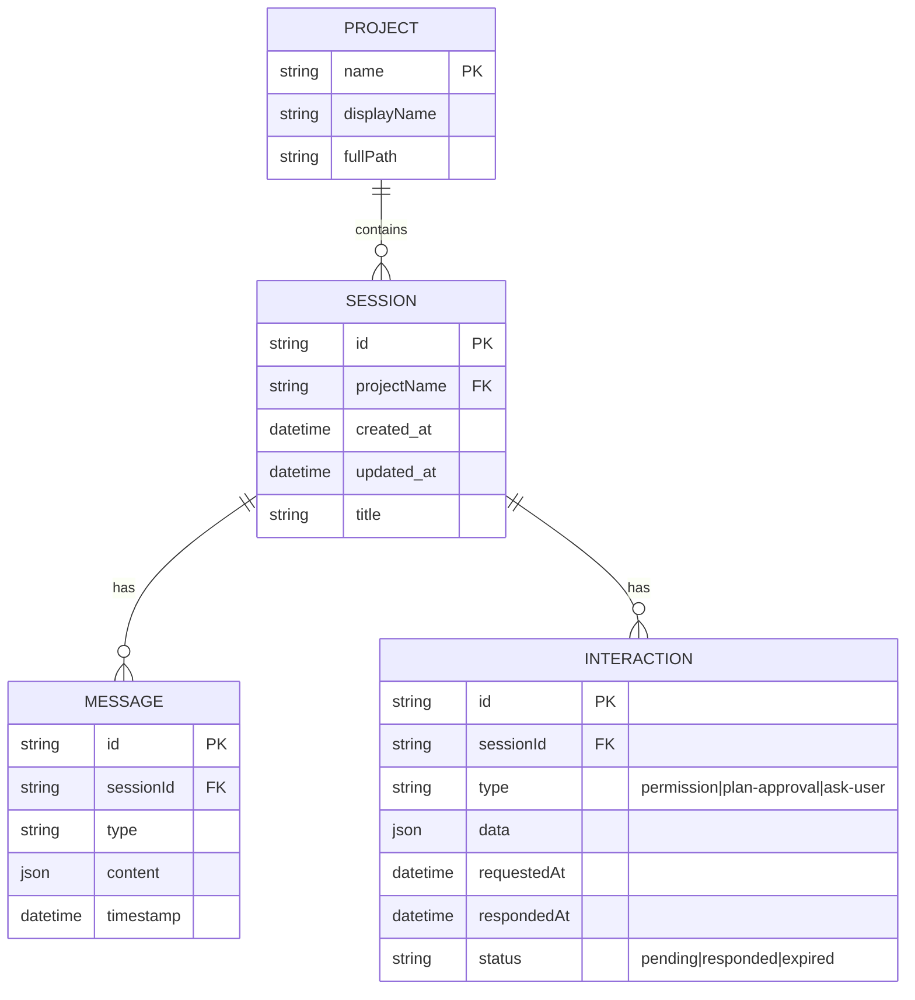

# Session, WebSocket, and Interaction Sync Architecture

## Overview

This plan addresses the session/WebSocket/interaction synchronization bugs. Instead of patching individual issues, this document proposes a comprehensive architectural overhaul.

## Current State Analysis

### 1. Messages vs Interactions - Key Distinction

| Concept | Messages | Interactions |
|---------|----------|--------------|
| **What** | Chat content (user/assistant turns, tool calls, outputs) | Action requests requiring user response (permissions, plan approvals, ask-user questions) |
| **Lifecycle** | Persistent in JSONL files, loaded from history | Ephemeral, 1-hour TTL in sessionStorage |
| **Source** | Loaded from server on session select | Created via WebSocket `interaction-request` events |
| **Storage** | Server-side JSONL files | Client-side sessionStorage (`claude-ui:interactions:{sessionId}`) |
| **Multi-tab** | Each tab loads independently from server | NOT synced across tabs (sessionStorage is tab-local) |

### 2. Current Data Flow

```
┌─────────────────────────────────────────────────────────────────────────────────┐
│                              CURRENT ARCHITECTURE                               │
├─────────────────────────────────────────────────────────────────────────────────┤
│                                                                                 │
│  ┌─────────┐        WebSocket (Single)       ┌─────────┐                       │
│  │ Server  │ ◀────────────────────────────▶  │  Tab A  │                       │
│  │         │                                 │         │                       │
│  │ - JSONL │                                 │ - sessionStorage                │
│  │ - State │                                 │ - React State                   │
│  └─────────┘                                 │ - InteractionContext            │
│       │                                      │ - PermissionContext             │
│       │                                      └─────────┘                       │
│       │                                            ╳ NOT SYNCED                │
│       │                                      ┌─────────┐                       │
│       └──────────────────────────────────▶   │  Tab B  │                       │
│              WebSocket (Separate)            │         │                       │
│                                              │ - sessionStorage (TAB-LOCAL)    │
│                                              │ - React State                   │
│                                              └─────────┘                       │
│                                                                                 │
└─────────────────────────────────────────────────────────────────────────────────┘
```

### 3. Identified Root Causes of Bugs

#### Bug 1: Interactions Don't Sync Across Tabs
- **Cause**: `sessionStorage` is tab-specific, not shared
- **Impact**: Responding to interaction in Tab A doesn't remove it from Tab B

#### Bug 2: Switching Sessions Loses Interaction State
- **Cause**: `InteractionProvider` receives `sessionIds` from URL params
- **Impact**: When URL changes, React re-mounts provider, clearing state before loading from storage

#### Bug 3: Interactions Appear in Wrong Session
- **Cause**: Race condition between WebSocket message arrival and `sessionIds` prop update
- **Impact**: Interaction arrives before context knows about new session

#### Bug 4: Interactions Not Recoverable from History
- **Cause**: Interactions are client-only, not persisted in JSONL message history
- **Impact**: Refreshing page or opening new tab loses pending interactions if not in sessionStorage

#### Bug 5: WebSocket Session Filtering Issues
- **Cause**: `currentSessionIdRef` in websocket.js set imperatively, not in sync with React state
- **Impact**: Messages arrive for wrong session during transition

### 4. Your Requirements

1. ✅ Each chat is a separate session
2. ✅ When switching to a session with interaction requests, can address them
3. ✅ Can switch to other sessions freely
4. ✅ Many tabs open (same or different sessions)
5. ✅ Respond to interaction in one tab → disappears in other tabs
6. ✅ Everything should be in sync
7. ❓ Can interactions be loaded from history?

---

## Solution 1: Server-Side Interaction State (Recommended)

### Concept
Move interaction state management to the server. The server becomes the single source of truth for pending interactions.

### Architecture

```
┌─────────────────────────────────────────────────────────────────────────────────┐
│                    SOLUTION 1: SERVER-SIDE STATE                                │
├─────────────────────────────────────────────────────────────────────────────────┤
│                                                                                 │
│  ┌─────────────────────────────────────────────────────────────────┐            │
│  │                          SERVER                                 │            │
│  │                                                                 │            │
│  │  ┌─────────────┐    ┌──────────────────────────────────────┐   │            │
│  │  │ JSONL Files │    │      Interaction State Manager       │   │            │
│  │  │ (messages)  │    │                                      │   │            │
│  │  └─────────────┘    │  - Map<sessionId, Interaction[]>     │   │            │
│  │                     │  - Broadcast on change               │   │            │
│  │                     │  - Persist to disk (optional)        │   │            │
│  │                     └──────────────────────────────────────┘   │            │
│  │                          │                │                    │            │
│  └──────────────────────────┼────────────────┼────────────────────┘            │
│                             │                │                                  │
│           ┌─────────────────┘                └─────────────────┐                │
│           │                                                    │                │
│           ▼                                                    ▼                │
│  ┌─────────────────┐                                ┌─────────────────┐         │
│  │     Tab A       │                                │     Tab B       │         │
│  │                 │   Broadcast: "interaction-     │                 │         │
│  │ session: abc123 │   removed" {id, sessionId}     │ session: abc123 │         │
│  │                 │ ◀──────────────────────────▶   │                 │         │
│  │ On connect:     │                                │ On connect:     │         │
│  │ → sync request  │                                │ → sync request  │         │
│  │ ← full state    │                                │ ← full state    │         │
│  └─────────────────┘                                └─────────────────┘         │
│                                                                                 │
└─────────────────────────────────────────────────────────────────────────────────┘
```

### Implementation Plan

#### Phase 1: Server-Side Interaction Store

**server/interactionStore.js**
```javascript
class InteractionStore {
  constructor() {
    this.interactions = new Map();
    this.subscribers = new Set();
  }

  addInteraction(sessionId, interaction) {
    if (!this.interactions.has(sessionId)) {
      this.interactions.set(sessionId, []);
    }
    this.interactions.get(sessionId).push(interaction);
    this.broadcast('interaction-added', { sessionId, interaction });
  }

  removeInteraction(sessionId, interactionId) {
    const sessionInteractions = this.interactions.get(sessionId);
    if (sessionInteractions) {
      const index = sessionInteractions.findIndex(i => i.id === interactionId);
      if (index !== -1) {
        sessionInteractions.splice(index, 1);
        this.broadcast('interaction-removed', { sessionId, interactionId });
      }
    }
  }

  getInteractions(sessionId) {
    return this.interactions.get(sessionId) || [];
  }

  subscribe(ws) {
    this.subscribers.add(ws);
  }

  unsubscribe(ws) {
    this.subscribers.delete(ws);
  }

  broadcast(type, data) {
    const message = JSON.stringify({ type, ...data });
    for (const ws of this.subscribers) {
      if (ws.readyState === WebSocket.OPEN) {
        ws.send(message);
      }
    }
  }
}
```

#### Phase 2: Update WebSocket Protocol

**New Message Types:**
```typescript
// Client → Server
{ type: 'interaction-subscribe', sessionIds: string[] }
{ type: 'interaction-unsubscribe', sessionIds: string[] }
{ type: 'interaction-response', interactionId: string, response: any }

// Server → Client
{ type: 'interaction-state', sessionId: string, interactions: Interaction[] }
{ type: 'interaction-added', sessionId: string, interaction: Interaction }
{ type: 'interaction-removed', sessionId: string, interactionId: string }
```

#### Phase 3: Frontend Simplification

**InteractionContext.jsx (simplified)**
```jsx
export const InteractionProvider = ({ children, sessionIds = [] }) => {
  const { ws, isConnected } = useWebSocketContext();
  const [interactions, setInteractions] = useState([]);

  useEffect(() => {
    if (!ws || !isConnected) return;

    // Subscribe to sessions
    ws.send(JSON.stringify({
      type: 'interaction-subscribe',
      sessionIds
    }));

    const handler = (event) => {
      const data = JSON.parse(event.data);

      switch (data.type) {
        case 'interaction-state':
          setInteractions(data.interactions);
          break;
        case 'interaction-added':
          setInteractions(prev => [...prev, data.interaction]);
          break;
        case 'interaction-removed':
          setInteractions(prev => prev.filter(i => i.id !== data.interactionId));
          break;
      }
    };

    ws.addEventListener('message', handler);

    return () => {
      ws.removeEventListener('message', handler);
      ws.send(JSON.stringify({
        type: 'interaction-unsubscribe',
        sessionIds
      }));
    };
  }, [ws, isConnected, sessionIds]);

  // ... rest of context
};
```

### Pros
- Single source of truth (server)
- Automatic cross-tab sync via WebSocket broadcast
- Works with any number of tabs
- Interaction state survives page refresh
- Can optionally persist interactions to disk

### Cons
- Requires server changes
- More complex server logic
- Slightly more network traffic

---

## Solution 2: BroadcastChannel API (Client-Side Sync)

### Concept
Keep client-side storage but use the BroadcastChannel API to sync state changes across tabs.

### Architecture

```
┌─────────────────────────────────────────────────────────────────────────────────┐
│                  SOLUTION 2: BROADCASTCHANNEL SYNC                              │
├─────────────────────────────────────────────────────────────────────────────────┤
│                                                                                 │
│  ┌──────────────────────────────────────────────────────────────────────────┐   │
│  │                       BroadcastChannel: 'claude-ui-sync'                 │   │
│  └──────────────────────────────────────────────────────────────────────────┘   │
│          ▲                                                      ▲               │
│          │ postMessage                                          │ postMessage   │
│          │                                                      │               │
│  ┌───────┴─────────┐                                ┌───────────┴─────┐         │
│  │     Tab A       │                                │     Tab B       │         │
│  │                 │                                │                 │         │
│  │ localStorage    │  ← Shared across tabs          │ localStorage    │         │
│  │ (permanent      │                                │ (permanent      │         │
│  │  permissions)   │                                │  permissions)   │         │
│  │                 │                                │                 │         │
│  │ React State     │  postMessage: {                │ React State     │         │
│  │ (interactions)  │    action: 'remove',           │ (interactions)  │         │
│  │                 │    id: 'xyz',                  │                 │         │
│  │ Action:         │    sessionId: 'abc'            │ Receives:       │         │
│  │ Remove 'xyz'    │  } ──────────────────────────▶ │ Remove 'xyz'    │         │
│  │                 │                                │                 │         │
│  └─────────────────┘                                └─────────────────┘         │
│                                                                                 │
└─────────────────────────────────────────────────────────────────────────────────┘
```

### Implementation Plan

#### Phase 1: Create Sync Service

**src/utils/interactionSyncService.js**
```javascript
const CHANNEL_NAME = 'claude-ui-interactions';

class InteractionSyncService {
  constructor() {
    this.channel = new BroadcastChannel(CHANNEL_NAME);
    this.listeners = new Set();

    this.channel.onmessage = (event) => {
      this.listeners.forEach(listener => listener(event.data));
    };
  }

  broadcast(action, data) {
    this.channel.postMessage({ action, ...data, timestamp: Date.now() });
  }

  addListener(listener) {
    this.listeners.add(listener);
    return () => this.listeners.delete(listener);
  }

  interactionAdded(sessionId, interaction) {
    this.broadcast('interaction-added', { sessionId, interaction });
  }

  interactionRemoved(sessionId, interactionId) {
    this.broadcast('interaction-removed', { sessionId, interactionId });
  }

  requestFullSync(sessionId) {
    this.broadcast('sync-request', { sessionId });
  }

  sendFullState(sessionId, interactions) {
    this.broadcast('sync-response', { sessionId, interactions });
  }
}

export const interactionSyncService = new InteractionSyncService();
```

#### Phase 2: Update Storage to Use localStorage

Change from `sessionStorage` to `localStorage` for shared access:

**src/utils/interactionStorage.js**
```javascript
const STORAGE_KEY_PREFIX = 'claude-ui:interactions:';

export function savePendingInteraction(sessionId, interaction) {
  // Use localStorage instead of sessionStorage
  const key = `${STORAGE_KEY_PREFIX}${sessionId}`;
  const existing = JSON.parse(localStorage.getItem(key) || '[]');
  const updated = [...existing.filter(i => i.id !== interaction.id), interaction];
  localStorage.setItem(key, JSON.stringify(updated));

  // Broadcast change to other tabs
  interactionSyncService.interactionAdded(sessionId, interaction);
}

export function removePendingInteraction(sessionId, interactionId) {
  const key = `${STORAGE_KEY_PREFIX}${sessionId}`;
  const existing = JSON.parse(localStorage.getItem(key) || '[]');
  const updated = existing.filter(i => i.id !== interactionId);
  localStorage.setItem(key, JSON.stringify(updated));

  // Broadcast change to other tabs
  interactionSyncService.interactionRemoved(sessionId, interactionId);
}
```

#### Phase 3: Update InteractionContext to Listen for Changes

**InteractionContext.jsx**
```jsx
useEffect(() => {
  const unsubscribe = interactionSyncService.addListener((message) => {
    switch (message.action) {
      case 'interaction-added':
        if (sessionIds.includes(message.sessionId)) {
          setPendingInteractions(prev => {
            if (prev.find(i => i.id === message.interaction.id)) return prev;
            return [...prev, message.interaction];
          });
        }
        break;

      case 'interaction-removed':
        setPendingInteractions(prev =>
          prev.filter(i => i.id !== message.interactionId)
        );
        break;
    }
  });

  return unsubscribe;
}, [sessionIds]);
```

### Pros
- No server changes required
- Uses modern browser APIs
- Lower complexity than server solution
- Immediate sync (no network latency)

### Cons
- Won't sync across different browsers/devices
- Relies on browser support (BroadcastChannel is well-supported)
- localStorage has size limits (~5MB)
- Still need server sync for initial interaction creation

---

## Solution 3: Hybrid - Server Authority with Optimistic Updates

### Concept
Server is the source of truth, but client makes optimistic updates immediately with eventual consistency via WebSocket sync.

### Architecture

```
┌─────────────────────────────────────────────────────────────────────────────────┐
│                   SOLUTION 3: HYBRID OPTIMISTIC                                 │
├─────────────────────────────────────────────────────────────────────────────────┤
│                                                                                 │
│  ┌─────────────────────────────────────────────────────────────────┐            │
│  │                          SERVER                                 │            │
│  │                                                                 │            │
│  │  ┌─────────────────────────────────────────────────────────┐   │            │
│  │  │              Interaction State (Authoritative)          │   │            │
│  │  │                                                         │   │            │
│  │  │  On response received:                                  │   │            │
│  │  │  1. Remove interaction from store                       │   │            │
│  │  │  2. Broadcast 'interaction-removed' to ALL connections  │   │            │
│  │  └─────────────────────────────────────────────────────────┘   │            │
│  └──────────────────────────────────────────────────────────────────┘          │
│                             │                                                   │
│          ┌──────────────────┴────────────────────┐                             │
│          │                                       │                             │
│          ▼                                       ▼                             │
│  ┌───────────────────┐                 ┌───────────────────┐                   │
│  │      Tab A        │                 │      Tab B        │                   │
│  │                   │                 │                   │                   │
│  │ 1. User clicks    │                 │ 4. Receives WS    │                   │
│  │    "Allow"        │                 │    broadcast      │                   │
│  │                   │                 │                   │                   │
│  │ 2. OPTIMISTIC:    │                 │ 5. Updates state  │                   │
│  │    Remove from UI │                 │    (removes       │                   │
│  │    immediately    │  ─────────────▶ │    interaction)   │                   │
│  │                   │  WS: response   │                   │                   │
│  │ 3. Send response  │                 │                   │                   │
│  │    to server      │                 │                   │                   │
│  └───────────────────┘                 └───────────────────┘                   │
│                                                                                 │
└─────────────────────────────────────────────────────────────────────────────────┘
```

### Implementation Plan

This is a combination of Solution 1 and Solution 2:

1. **Server maintains authoritative state** (like Solution 1)
2. **Client makes optimistic updates** for better UX
3. **Server broadcasts confirmations** that trigger final state updates
4. **BroadcastChannel** as backup for same-browser tabs (like Solution 2)

### Key Flow

```
User Action (Tab A) → Optimistic Update (Tab A) → WebSocket to Server
                                                        ↓
Server Updates State → Broadcasts to ALL → Tab B updates
                                         → Tab A confirms (or rolls back if failed)
```

### Pros
- Best UX (instant feedback)
- Server authority ensures consistency
- Handles network issues gracefully
- Works across browsers/devices

### Cons
- Most complex to implement
- Potential for temporary inconsistencies
- Rollback logic needed for failures

---

## Can Interactions Be Loaded from History?

### Current State
**No** - Interactions are not stored in the JSONL message history. They exist only in:
1. sessionStorage (current implementation)
2. Server memory (ephemeral, lost on restart)

### How to Enable This

To recover interactions from history, you would need to:

1. **Store interactions in JSONL** when they're created:
```json
{"type": "interaction-request", "id": "abc123", "interactionType": "permission", "data": {...}, "timestamp": 1234567890}
```

2. **Store responses in JSONL** when user responds:
```json
{"type": "interaction-response", "interactionId": "abc123", "decision": "allow", "timestamp": 1234567891}
```

3. **On history load**, parse these entries and reconstruct pending interactions (those without responses).

### Recommendation
This is a **nice-to-have** but not essential if you implement Solution 1 (server-side state with optional persistence). The server can persist interactions to disk independently of the JSONL files.

---

## Recommendation

**Implement Solution 1 (Server-Side State)** with these phases:

### Phase 1: Core Infrastructure (Critical)
- [ ] Create `InteractionStore` class on server
- [ ] Add WebSocket broadcast capability
- [ ] Update WebSocket message protocol

### Phase 2: Frontend Simplification
- [ ] Remove sessionStorage-based interaction storage
- [ ] Update `InteractionContext` to be WebSocket-driven
- [ ] Simplify `usePermissions` hook

### Phase 3: Polish
- [ ] Add optional persistence to disk
- [ ] Add BroadcastChannel as optimization for same-browser tabs
- [ ] Add connection state handling (reconnection, offline)

### MVP

**server/interactionStore.js**
```javascript
class InteractionStore {
  constructor() {
    this.interactions = new Map();
    this.connections = new Map();
  }

  subscribe(ws, sessionIds) {
    this.connections.set(ws, sessionIds);
    sessionIds.forEach(id => {
      const interactions = this.getInteractions(id);
      ws.send(JSON.stringify({
        type: 'interaction-state',
        sessionId: id,
        interactions
      }));
    });
  }

  unsubscribe(ws) {
    this.connections.delete(ws);
  }

  addInteraction(sessionId, interaction) {
    if (!this.interactions.has(sessionId)) {
      this.interactions.set(sessionId, new Map());
    }
    this.interactions.get(sessionId).set(interaction.id, interaction);
    this.broadcastToSession(sessionId, {
      type: 'interaction-added',
      sessionId,
      interaction
    });
  }

  removeInteraction(sessionId, interactionId) {
    this.interactions.get(sessionId)?.delete(interactionId);
    this.broadcastToSession(sessionId, {
      type: 'interaction-removed',
      sessionId,
      interactionId
    });
  }

  broadcastToSession(sessionId, message) {
    for (const [ws, sessionIds] of this.connections) {
      if (sessionIds.includes(sessionId) && ws.readyState === WebSocket.OPEN) {
        ws.send(JSON.stringify(message));
      }
    }
  }
}
```

---

## ERD: Data Relationships



---

## References

- `src/contexts/InteractionContext.jsx` - Current interaction state management
- `src/utils/websocket.js:76-119` - WebSocket message handling
- `src/utils/interactionStorage.js` - sessionStorage implementation
- `src/hooks/usePermissions.js` - Permission WebSocket integration
- `src/App.jsx:949-967` - Provider wrapper setup