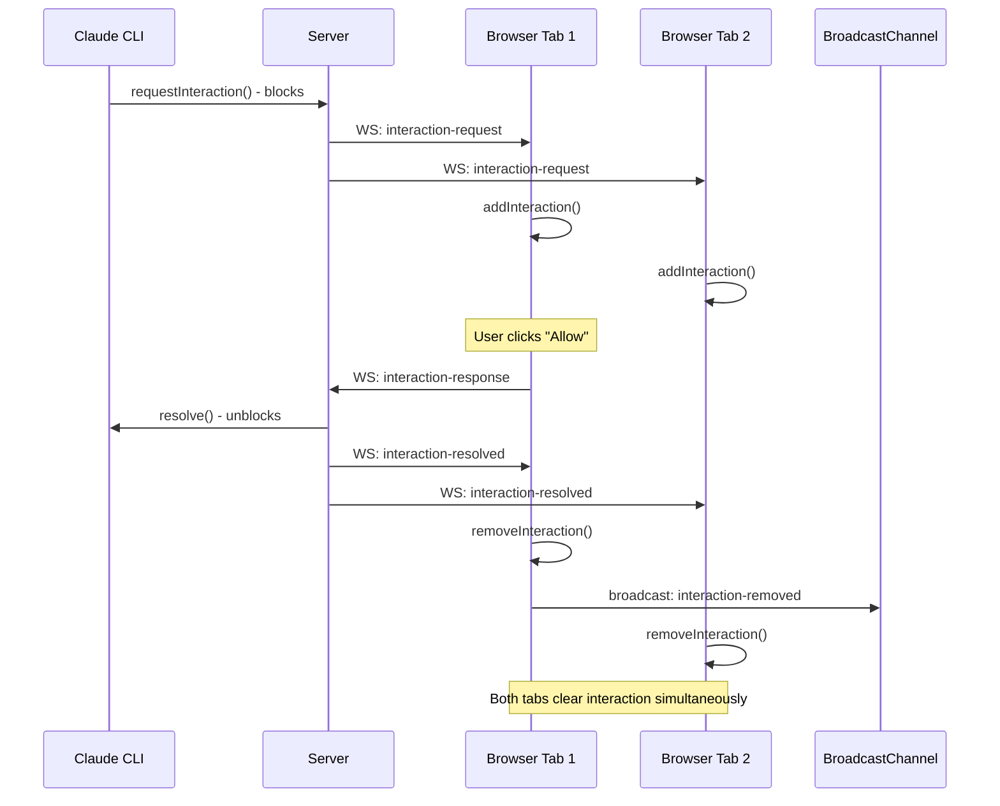

# feat: Simplify WebSocket/Interaction Architecture with Cross-Tab Sync

## Overview

Refactor the interaction system (permissions, plan-approval, ask-user) to fix cross-tab synchronization bugs by removing sessionStorage complexity and adding BroadcastChannel for real-time cross-tab updates.

## Problem Statement

The current interaction system has multiple bugs causing poor user experience:

1. **sessionStorage is tab-isolated** - Interactions in one tab are invisible to other tabs
2. **State lost on navigation** - InteractionContext remounts when URL changes, clearing state
3. **Race condition** - `currentSessionIdRef` in websocket.js not synchronized with React state
4. **No cross-tab removal** - Responding to interaction in Tab A doesn't clear it from Tab B
5. **Over-engineered persistence** - Complex TTL logic in sessionStorage that doesn't work across tabs anyway

## Proposed Solution

**Remove sessionStorage. Add BroadcastChannel. Keep WebSocket simple.**

```
┌─────────────────────────────────────────────────────────────────┐
│                        SERVER                                    │
│  interactionManager.pendingInteractions (Map)                   │
│  - Single source of truth                                       │
│  - In-memory (interactions are ephemeral by design)             │
└───────────────────────────┬─────────────────────────────────────┘
                            │ WebSocket broadcasts to ALL clients
                            ▼
┌─────────────────────────────────────────────────────────────────┐
│                        BROWSER                                   │
│  ┌─────────────────┐    BroadcastChannel    ┌─────────────────┐ │
│  │   Tab 1         │◀─────────────────────▶│   Tab 2         │ │
│  │   React State   │                        │   React State   │ │
│  └─────────────────┘                        └─────────────────┘ │
│                                                                  │
│  When Tab 1 responds:                                           │
│  1. Send response via WebSocket                                 │
│  2. Server resolves Promise, broadcasts 'interaction-resolved'  │
│  3. ALL tabs receive broadcast, remove interaction from UI      │
│  4. BroadcastChannel ensures immediate cross-tab sync           │
└─────────────────────────────────────────────────────────────────┘
```

## Technical Approach

### Phase 1: Add BroadcastChannel Infrastructure

**Create:** `src/utils/interactionBroadcast.js`

```javascript
import { useEffect, useRef, useCallback } from 'react';

const CHANNEL_NAME = 'claude-interactions';

export function useBroadcastChannel(onMessage) {
  const channelRef = useRef(null);
  const onMessageRef = useRef(onMessage);

  useEffect(() => {
    onMessageRef.current = onMessage;
  }, [onMessage]);

  useEffect(() => {
    if (typeof BroadcastChannel === 'undefined') {
      console.warn('BroadcastChannel not supported - cross-tab sync disabled');
      return;
    }

    const channel = new BroadcastChannel(CHANNEL_NAME);
    channelRef.current = channel;

    channel.onmessage = (event) => {
      onMessageRef.current?.(event.data);
    };

    return () => {
      channel.close();
      channelRef.current = null;
    };
  }, []);

  const broadcast = useCallback((data) => {
    channelRef.current?.postMessage(data);
  }, []);

  return { broadcast, isSupported: typeof BroadcastChannel !== 'undefined' };
}
```

### Phase 2: Simplify InteractionContext

**Modify:** `src/contexts/InteractionContext.jsx`

Key changes:
- Remove all sessionStorage imports and usage
- Add BroadcastChannel hook
- Broadcast on add/remove/update operations
- Listen for broadcasts from other tabs

```javascript
// REMOVE these imports:
// import { savePendingInteraction, removePendingInteraction, ... } from '../utils/interactionStorage';

// ADD:
import { useBroadcastChannel } from '../utils/interactionBroadcast';

export const InteractionProvider = ({ children, sessionIds = [] }) => {
  const [pendingInteractions, setPendingInteractions] = useState([]);

  const handleBroadcast = useCallback((data) => {
    switch (data.type) {
      case 'interaction-added':
        if (sessionIds.includes(data.interaction.sessionId)) {
          setPendingInteractions(prev => {
            if (prev.find(i => i.id === data.interaction.id)) return prev;
            return [...prev, data.interaction];
          });
        }
        break;
      case 'interaction-removed':
        setPendingInteractions(prev => prev.filter(i => i.id !== data.interactionId));
        break;
      case 'interaction-updated':
        setPendingInteractions(prev =>
          prev.map(i => i.id === data.interactionId ? { ...i, ...data.updates } : i)
        );
        break;
    }
  }, [sessionIds]);

  const { broadcast } = useBroadcastChannel(handleBroadcast);

  const addInteraction = useCallback((interaction) => {
    const interactionWithTimestamp = {
      ...interaction,
      requestedAt: interaction.requestedAt || Date.now()
    };

    // Broadcast to other tabs
    broadcast({ type: 'interaction-added', interaction: interactionWithTimestamp });

    // Add to local state if matches current sessions
    if (sessionIds.includes(interaction.sessionId)) {
      setPendingInteractions(prev => {
        if (prev.find(i => i.id === interaction.id)) {
          return prev.map(i => i.id === interaction.id ? interactionWithTimestamp : i);
        }
        return [...prev, interactionWithTimestamp];
      });
    }
  }, [sessionIds, broadcast]);

  const removeInteraction = useCallback((interactionId) => {
    broadcast({ type: 'interaction-removed', interactionId });
    setPendingInteractions(prev => prev.filter(i => i.id !== interactionId));
  }, [broadcast]);

  // ... rest of context (simplified)
};
```

### Phase 3: Server Broadcasts Resolution to ALL Clients

**Modify:** `server/services/permissionWebSocketHandler.js`

When an interaction is resolved, broadcast to ALL connected clients (not just the responding one):

```javascript
handleInteractionResponse(ws, response) {
  // ... existing logic to resolve interaction ...

  // NEW: Broadcast resolution to ALL clients
  this.broadcastToAll({
    type: 'interaction-resolved',
    interactionId: response.interactionId,
    sessionId: response.sessionId,
    resolvedAt: Date.now()
  });
}
```

### Phase 4: Handle 'interaction-resolved' in Client

**Modify:** `src/hooks/useInteractions.js`

Listen for server broadcasts about resolved interactions:

```javascript
useEffect(() => {
  const handleMessage = (data) => {
    if (data.type === 'interaction-request') {
      addInteraction(transformToInteraction(data));
    } else if (data.type === 'interaction-resolved') {
      // Server confirmed interaction was resolved - remove from UI
      removeInteraction(data.interactionId);
    }
  };

  wsClient.addMessageListener(handleMessage);
  return () => wsClient.removeMessageListener(handleMessage);
}, [addInteraction, removeInteraction]);
```

### Phase 5: Cleanup

**Delete:** `src/utils/interactionStorage.js`

Remove all references to this file from:
- `src/contexts/InteractionContext.jsx`
- Any other files importing it

## Files to Modify

| File | Action | Lines |
|------|--------|-------|
| `src/utils/interactionBroadcast.js` | CREATE | ~50 |
| `src/contexts/InteractionContext.jsx` | SIMPLIFY | -80, +40 |
| `src/hooks/useInteractions.js` | ADD handler | +15 |
| `server/services/permissionWebSocketHandler.js` | ADD broadcast | +10 |
| `src/utils/interactionStorage.js` | DELETE | -142 |

**Net change: ~-115 lines**

## ERD: Message Flow



## Acceptance Criteria

### Functional Requirements
- [ ] Interaction appears in ALL open tabs for that session
- [ ] Responding in one tab clears interaction from ALL tabs
- [ ] New tab opening sees existing pending interactions (via server sync)
- [ ] Browser refresh restores pending interactions (via server sync)
- [ ] Multiple sessions in different tabs are isolated correctly

### Non-Functional Requirements
- [ ] Cross-tab sync latency < 100ms (via BroadcastChannel)
- [ ] No memory leaks from BroadcastChannel
- [ ] Graceful degradation in browsers without BroadcastChannel support
- [ ] Net reduction in code complexity (~115 lines removed)

### Quality Gates
- [ ] All existing interaction tests pass
- [ ] Manual test: 3 tabs, respond in one, all clear
- [ ] Manual test: Refresh page, interactions restored
- [ ] No console errors related to interactions

## Risk Analysis

| Risk | Mitigation |
|------|------------|
| BroadcastChannel not supported in old browsers | Graceful degradation - tabs work independently, server sync still works |
| Race between BroadcastChannel and WebSocket | Both trigger same action (removeInteraction) - deduplicated by ID |
| Server restart loses pending interactions | Existing behavior - interactions are ephemeral by design |

## References

### Internal References
- Current InteractionContext: `src/contexts/InteractionContext.jsx`
- WebSocket handler: `src/utils/websocket.js`
- Server interaction manager: `server/services/interactionManager.js`
- Previous plan: `plans/session-websocket-interaction-sync-architecture.md`

### External References
- BroadcastChannel API: https://developer.mozilla.org/en-US/docs/Web/API/Broadcast_Channel_API
- Browser support (95.67%): https://caniuse.com/broadcastchannel
